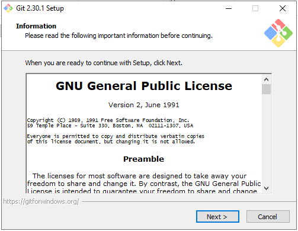
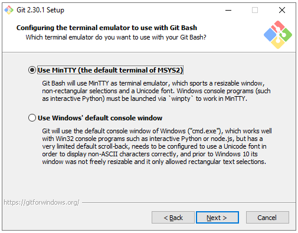

# Installation pour la formation Git

1. Installer Visual Studio Code
2. Installer Git
3. Créer un compte sur GitHub.com

## Visual Studio Code

Installer visual Studio Code à partir du site web officiel. https://code.visualstudio.com/

## Installer Git

Installer Git à partir du site officiel. https://git-scm.com/.

Les écrans avec du **_rouge_** sont modifiés.

.png)

 

## Créer un compte sur GitHub.com

Allez sur github.com et créez un compte. https://github.com

